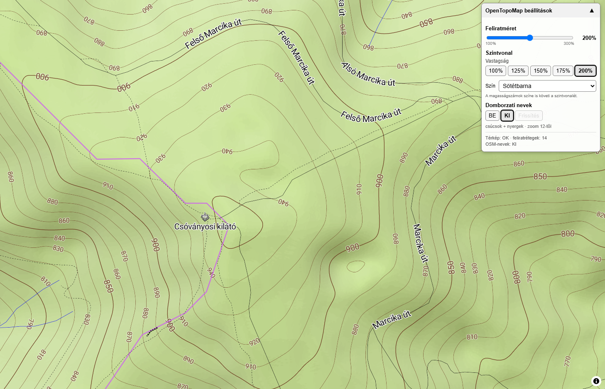

# OpenTopoMap Vector – saját beállítások

Violentmonkey userscript az OpenTopoMap vektoros változatához.

A script célja, hogy kivetítéskor vagy oktatási használat során jobban láthatóvá és könnyebben beállíthatóvá tegye az OpenTopoMap Vector térképet.

## Képernyőkép

## Funkciók

A script jelenleg az alábbi lehetőségeket adja hozzá:

- a térképi feliratok méretének módosítása 100–300% között;
- a szintvonalak vastagságának módosítása;
- a szintvonalak színének módosítása;
- a szintvonalak magasságfeliratainak a vonalakkal azonos színű megjelenítése;
- opcionális kiegészítő domborzati nevek megjelenítése OpenStreetMap-adatokból;
- a kiegészítő domborzati nevek kézi frissítése;
- összecsukható kezelőpanel.

A kezelőpanel a térkép jobb felső részén jelenik meg.

## Feliratméret

A térképi feliratok mérete egy csúszkával állítható.

Tartomány:

- minimum: 100%
- maximum: 300%
- lépésköz: 25%

Lehetséges értékek:

`100% · 125% · 150% · 175% · 200% · 225% · 250% · 275% · 300%`

A kiválasztott értéket a script elmenti, így az a következő megnyitáskor is megmarad.

## Szintvonalak

### Vastagság

A vektoros OpenTopoMap szintvonalainak vastagsága az alábbi értékek közül választható:

- 100%
- 125%
- 150%
- 175%
- 200%

A kiválasztott értéket a script elmenti.

### Szín

A szintvonalak színe az alábbi lehetőségek közül választható:

- Eredeti
- Sötétbarna
- Sötétszürke
- Fekete

A szintvonalakon megjelenő magasságértékek színe automatikusan követi a szintvonal színét.

Így könnyebben felismerhető, hogy az adott számok a szintvonalak magasságértékei.

A kiválasztott színt a script szintén megjegyzi.

## Összecsukható kezelőpanel

A teljes kezelőpanel összecsukható.

Nyitott állapotban minden beállítás elérhető, összecsukva pedig csak a panel fejléce marad látható.

Ez különösen hasznos kivetítéskor, amikor a beállítások elvégzése után célszerű minél nagyobb térképfelületet szabadon hagyni.

A panel minden új oldalbetöltéskor nyitott állapotban indul.

## Domborzati nevek

A script opcionálisan további domborzati neveket tud megjeleníteni az OpenStreetMap adataiból.

Jelenleg az alábbi objektumokat kezeli:

- csúcsok (`natural=peak`)
- nyergek (`natural=saddle`)

A kiegészítő nevek csak 12-es vagy nagyobb zoomszinten jelennek meg.

### BE

Bekapcsolja a kiegészítő OSM-nevek használatát.

A script ekkor:

1. létrehozza a szükséges saját térképréteget;
2. ellenőrzi, van-e használható gyorsítótárazott adat;
3. szükség esetén lekérdezi az aktuálisan látható terület csúcs- és nyeregadatait;
4. megjeleníti azokat a térképen.

### KI

Kikapcsolja a kiegészítő domborzati neveket.

Kikapcsolt állapotban:

- nem indul Overpass-lekérdezés;
- nem töltődnek be a gyorsítótárazott OSM-nevek a térképre;
- a script eltávolítja a saját névrétegét;
- egy esetleg futó lekérdezést is megszakít.

A domborzati nevek minden új oldalbetöltéskor alapértelmezetten **kikapcsolt állapotban** indulnak.

### Frissítés

A `Frissítés` gomb csak akkor aktív, amikor a domborzati nevek be vannak kapcsolva.

Segítségével kézzel újra lekérdezhetők az OSM-adatok az aktuálisan látható területre.

Ez akkor lehet hasznos, ha:

- az Overpass-szerver korábban nem válaszolt;
- a térképet nagyobb távolságra elmozdítottuk;
- friss OSM-adatot szeretnénk lekérni.

## Adatforrások

A script az OpenTopoMap Vector térképet módosítja.

A kiegészítő domborzati nevekhez az OpenStreetMap adatait használja.

Az OSM-adatok lekérdezése Overpass API-n keresztül történik.

A script több Overpass-szervert is ismer, így ha az egyik éppen nem elérhető, megpróbálhat egy másikat.

## Gyorsítótár

A script a sikeresen lekért OSM-neveket helyileg gyorsítótárazza.

A gyorsítótár célja, hogy ugyanarra a területre ne kelljen feleslegesen újra lekérni az adatokat.

A gyorsítótárban tárolt adatok legfeljebb 6 órán át használhatók.

Fontos: a gyorsítótár tartalma csak akkor kerül vissza a térképre, ha a felhasználó külön bekapcsolja a domborzati neveket.

## Telepítés

### 1. Violentmonkey telepítése

A script használatához szükség van egy userscript-kezelő böngészőbővítményre, például a Violentmonkeyra.

Chrome esetén a Violentmonkey a Chrome Webáruházból telepíthető.

### 2. A script telepítése

A Violentmonkey telepítése után nyisd meg az alábbi linket:

https://raw.githubusercontent.com/havassy/opentopomap-vector-tools/main/opentopomap-vector-tools.user.js

A Violentmonkey felismeri a `.user.js` fájlt, és felajánlja a script telepítését.

### 3. OpenTopoMap Vector megnyitása

A script ezen az oldalon működik:

https://www.opentopomap.org/vector/

Az oldal újratöltése után meg kell jelennie a jobb felső sarokban az új kezelőpanelnek.

## Használat

A kezelőpanel fő részei:

- Feliratméret
- Szintvonal
- Domborzati nevek

A feliratméret csúszkával állítható.

A szintvonalaknál külön beállítható:

- a vastagság;
- a szín.

A domborzati neveknél három gomb található:

- `BE`
- `KI`
- `Frissítés`

A panel fejléce segítségével a teljes kezelőfelület összecsukható és újra kinyitható.

## Állapotjelzés

A script állapotsora jelzi többek között:

- hogy a térkép sikeresen elérhető-e;
- hány feliratréteget kezel;
- hogy a kiegészítő domborzati nevek be vagy ki vannak-e kapcsolva;
- folyamatban van-e lekérdezés;
- hány kiegészítő név töltődött be;
- történt-e lekérdezési hiba.

## Fontos megjegyzés

A script csak az OpenTopoMap **vektoros** változatához készült.

A klasszikus raszteres OpenTopoMap feliratai és szintvonalai a képcsempék részét képezik, ezért azok külön-külön nem módosíthatók ugyanilyen módon.

A vektoros és a raszteres OpenTopoMap szintvonalai nem feltétlenül esnek pontosan egybe, mert a két változat eltérő domborzatmodellből és eltérő feldolgozással készülhet.

## Verzió

Jelenlegi verzió:

`2.2`

## Fájl

A userscript fájl neve:

`opentopomap-vector-tools.user.js`

## Projekt

GitHub repository:

https://github.com/havassy/opentopomap-vector-tools

## Licenc

A scripthez érdemes külön licencet választani.

Egyszerű, nyílt felhasználásra például megfelelő lehet az MIT License.

Az OpenTopoMap és az OpenStreetMap saját licencei és felhasználási feltételei ettől függetlenek.
